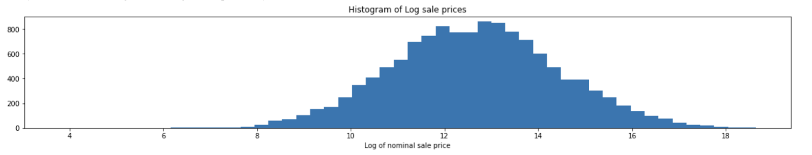

# Introduction
In this project, we aim to develop a reliable system to price art. Art experts have an idea of what a piece of art may sell for, however pieces often also sell outside of estimates at auction. Being able to more reliably predict the price of a piece of art could provide more stability for art as an investment, help protect parties before they put a piece to auction, and could help inform new collectors of what reasonable prices for a piece of art may be.

# Data Description
The data we are using comes from a study on the correlation between bereavement and creativity, with auction records for contemporary and impressionist paintings for 48 artists. The data has 14178 rows and 34 features, with many containing missing information and some features capturing the same information as other features. Features roughly fall into three categories: numerical/date values, categorical values represented as strings, and strings that aren’t categorical such as artwork title. Below, we outline steps we took to understand the data and how we are addressing missing and messy data. 

# Data Exploration and Preprocessing
Before the analysis stage of the project, it is imperative that we fully understand the data and every feature within. The first step we took was to look through the data columns where information was stored in strings, such as artist name and auction house. These columns will be encoded in a one-hot vector format since they are mutually exclusive and independent. We verified that there were no duplicate entries and that all entries matched a consistent format. The artist name strings contained birth and death dates as well, which we split off into their own columns so that they could be effectively utilized. Upon analyzing the auction house data, we discovered an important feature of the data: of the 294 auction houses, 4 houses were responsible for 78% of all transactions in our dataset (See figure below).

The dominance of these 4 houses is evident, and it would simplify our model if we could filter out the transactions from other houses since their behavior could be highly variable and without enough data per house to capture this behavior. Thus, we dropped all the rows which were not associated with these 4 houses. A similar analysis was conducted for artists (see figure below), but the transactions per artist are much more evenly distributed, and do not justify such filtering.

After validating the quality of text data, the next step was to drop columns that either held redundant data or data that we do not assume to have access to for the application purpose of this model. This includes columns of dates that appear multiple times and a currency column when everything is already in USD. For the data which we do not presume to have access to ahead of the future sale of a piece of art, this includes the lot number at the auction house, the CPI for a given year, whether the price is at auction hammer or not, and most importantly, the price estimates from the auction houses. Although it is possible to get price estimates before the sale of a piece, we would like this model to be scalable and easily applicable, and getting professional quotes on art prices is a labor and time-intensive process which impedes these goals.

Regarding the presence of missing or corrupted values, below is a histogram of the prevalence of NaN values within each column. The exact number is not important, but it shows that our data is relatively clean and we can approach the issue of missing values by dropping them. At first, it seems like the columns for father, mother, etc. are problematic, but this is just because these are one-hot vectors with NaN’s instead of 0’s, replacing these poses no issue. There are 2000 or so rows missing nominal price data, which we will drop since this data is essential. The missing price estimates are of no concern since we will be dropping these columns entirely. With the listed changes, we successfully eliminated all missing or corrupted data while retaining approximately 80% of the dataset.

  
The “Y” vector for this dataset is the nominal sale price. This data is lognormally distributed, as shown in the histogram below. Our model will be estimating the log-price of the paintings instead of the price itself so that the outcome of the model is the same order of magnitude and characterizing differences in distribution is easier and more interpretable.

  
Since no anomalies were found in price data, the last quality check was to make sure that the date data we had made sense. After verifying all date columns, we only found one row which had a painting made before the painter’s birth, which is impossible and we deleted that row. Finally, we encoded auction houses and artists in one-hot vector format, and the resulting data frame was a clean dataset, with every entry made up of integer or floating point numbers, and representative of information we expect to be available at the time of implementation.

# Preliminary Models
We ran several linear regression models with the primary goal of hypothesis testing, to determine which features may be significant in predicting the price of a piece of artwork. These also gave us an idea of a baseline for other models to use. When running the regression only on one-hot encoded artist names, we found that 22 of the artists were not statistically significant, meaning that the fact that they painted a painting was not a good predictor of price. The R-squared on only the artist data was 0.108. Running the regression only on numeric features, excluding the one hot encoded artists and the death features, the r-squared improved to 0.867. Several features in this model were not statistically significant, including lot number, paint date, whether the art was American, and the size of the art. Finally, we ran the regression on just the deaths features, which includes information on whether the artist experienced the death of a close family member or friend. This returned an r-squared of 0.115, and the only features that were not statistically significant in this model were the death of a second wife and the death of a first child.

Going forward, regressions may be a good model to try, especially when predicting log price, rather than price, though they do limit the use of the artwork titles, which need more advanced encoding. Principal component analysis may be useful for improving accuracy of the model, though it may be harder to apply to general data if the model were to be used as a tool. Tree based models might also perform better on this data. Additionally, we will need to split the data into training and test sets, to be able to calculate accuracy and determine if any models are overfitting. 

# More advanced encoding
We can also go further with the handling of string features such as the artist name and the title of the piece of art, using natural language processing. The idea would be to represent these features through embeddings, that is, vectors of the same length.
For the artist name, we thought about using the biographies of the artists that can be found on Wikipedia, to expand the data and describe in finer detail the artist. Wikipedia2Vec is an open-source tool for learning the embeddings of words and entities easily and efficiently from Wikipedia, and that we can use for representing the artist names. The vector that we obtain is of length 100.
Then, to capture the meaning of the name of a piece of art, we can use a pre-trained encoder as BERT (Bidirectional Encoder Representations from Transformers) that converts any sentence into a vector of length 768. Sentences with similar meanings will be close in the vector space.

Ikuya Yamada, Akari Asai, Jin Sakuma, Hiroyuki Shindo, Hideaki Takeda, Yoshiyasu Takefuji, Yuji Matsumoto, Wikipedia2Vec: An Efficient Toolkit for Learning and Visualizing the Embeddings of Words and Entities from Wikipedia.
Jacob Devlin, Ming-Wei Chang, Kenton Lee, Kristina Toutanova, BERT: Pre-training of Deep Bidirectional Transformers for Language Understanding
